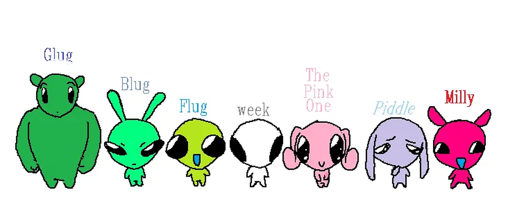

# Little Aliens Forever: Plushie Panic

Plushie Panic es un juego web competitivo para dos jugadores desarrollado con React, TypeScript y Express.

La partida ocurre dentro de una juguetería nocturna. Cada jugador controla un personaje de Little Aliens Forever y debe recorrer el escenario buscando dos peluches iguales. Cuando completa una pareja, debe regresar a su propia caja para guardarla y sumar un punto.

El primer jugador que consigue 3 pares gana.

## Aplicación publicada

La versión publicada del juego está disponible en:

https://lil-alienzzz-plushie-panic.onrender.com

El backend se puede comprobar directamente desde:

https://lil-alienzzz-plushie-panic.onrender.com/api/estado

## Cómo se juega

El juego está pensado para dos jugadores en el mismo dispositivo.

### Jugador 1

```text
W = arriba
A = izquierda
S = abajo
D = derecha
```

### Jugador 2

```text
↑ = arriba
← = izquierda
↓ = abajo
→ = derecha
```

No existe una tecla adicional para recoger objetos. Cuando un jugador pasa por la posición de un peluche, el juego intenta recogerlo automáticamente.

Si ya lleva un peluche, solamente puede recoger otro del mismo tipo.

Cuando consigue dos iguales debe volver a su caja para completar la pareja.

## Reglas principales

- Cada jugador comienza en una zona diferente.
- Los dos jugadores compiten por los mismos peluches.
- Existen seis tipos de peluches.
- Cada tipo aparece dos veces.
- Algunos muebles bloquean el movimiento.
- Los jugadores no pueden salir del escenario.
- Los jugadores no pueden ocupar la misma posición.
- Si ocurre un choque, el rival puede dejar caer el peluche que llevaba.
- Cada 10 movimientos los peluches que siguen en el piso cambian de posición.
- Gana el primer jugador que completa 3 pares.
- La partida tiene un máximo de 90 movimientos.
- Si se alcanza el límite, gana quien tenga más pares.
- Si ambos tienen el mismo puntaje, la partida termina en empate.

## Tecnologías utilizadas

### Frontend

- React
- TypeScript
- Vite
- CSS

### Backend

- Node.js
- Express
- TypeScript

### Pruebas y publicación

- Playwright
- GitHub Actions
- Render

La comunicación entre React y Express se realiza utilizando `fetch` y datos en formato JSON.

No se utilizan Axios, React Router, Redux, Bootstrap, Tailwind ni motores externos de juegos.

## Estructura del proyecto

```text
3er_parcial_react/
│
├── frontend/
│   ├── public/
│   └── src/
│
├── backend/
│   └── src/
│
├── e2e/
│   └── tests/
│
├── docs/
│
├── .github/
│   └── workflows/
│
├── package.json
├── render.yaml
└── README.md
```

## Instalación

Desde la carpeta principal del proyecto:

```bash
npm run install:all
```

Este comando instala las dependencias del frontend, backend y pruebas E2E.

## Compilar

```bash
npm run build
```

Este comando compila primero React y después Express.

## Ejecutar localmente

Después de realizar el build:

```bash
npm start
```

La aplicación queda disponible en:

```text
http://localhost:3000
```

En esta ejecución Express sirve tanto el backend como el frontend compilado.

## Lint

Para revisar el frontend y backend:

```bash
npm run lint
```

## Pruebas E2E

Las pruebas end-to-end fueron desarrolladas utilizando Playwright.

Ejecución normal:

```bash
npm run test:e2e
```

Ejecución visual:

```bash
npm run test:headed --prefix e2e
```

Para ejecutar la prueba visual sobre la aplicación publicada desde PowerShell:

```powershell
$env:BASE_URL="https://lil-alienzzz-plushie-panic.onrender.com"
npm run test:headed --prefix e2e
```

## API HTTP REST

### GET `/api/estado`

Permite comprobar que el backend está activo.

Ejemplo:

```json
{
  "ok": true,
  "juego": "Little Aliens Forever: Plushie Panic"
}
```

### POST `/api/partidas`

Crea una nueva partida.

Ejemplo:

```json
{
  "jugador1": {
    "personaje": "blug"
  },
  "jugador2": {
    "personaje": "milly"
  }
}
```

### GET `/api/partidas/:id`

Devuelve el estado actual de una partida.

### POST `/api/partidas/:id/acciones`

Envía una acción al backend.

Ejemplo:

```json
{
  "jugador": "j1",
  "tipo": "mover",
  "direccion": "derecha"
}
```

Las reglas principales de movimiento, colisiones, inventario, puntaje y finalización son procesadas por Express.

## GitHub Actions

El repositorio contiene workflows para:

- lint del frontend y backend;
- pruebas E2E;
- deployment.

El deployment hacia Render utiliza un Deploy Hook guardado como secreto de GitHub:

```text
RENDER_DEPLOY_HOOK_URL
```

## Publicación en Render

La aplicación se encuentra publicada como un Web Service.

Configuración utilizada:

```text
Build Command:
npm run render-build

Start Command:
npm start

Health Check:
 /api/estado
```

El backend utiliza `process.env.PORT` en producción y el puerto `3000` cuando se ejecuta localmente.

## Recursos visuales

Los personajes utilizados pertenecen a Little Aliens Forever y ya existían antes de este proyecto.

Se tomó como referencia el contenido publicado en: @lilalienz4ever

<p align="center">  </p>
Para integrarlos al juego se trabajaron las imágenes por separado, limpiando bordes, separando personajes y aumentando su resolución.

Los peluches y algunos elementos visuales propios del escenario fueron desarrollados como parte del proyecto con apoyo de herramientas digitales e inteligencia artificial.

## Documentación

La carpeta `docs/` contiene información adicional sobre:

- introducción y objetivo del juego;
- reglas;
- API;
- boceto;
- decisiones de diseño;
- investigación técnica;
- uso de inteligencia artificial.

## Demostración del juego

La demostración del juego se encuentra disponible en el siguiente enlace:

[Google Drive - Demostración de Little Aliens Forever: Plushie Panic](https://drive.google.com/drive/folders/1_wO4CXGvRHwN7gKBZi4PKf7ipgV6mAAa)
